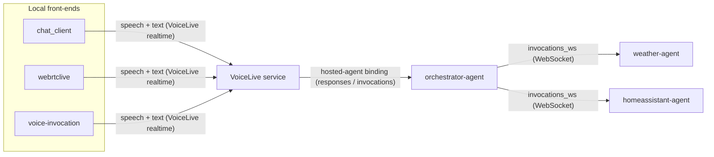

# VoiceLive Agents

A VoiceLive front-end talking to Azure AI Foundry **hosted agents**. A single
**orchestrator-agent** fronts the conversation and routes each request to one or
both specialist agents:

- **orchestrator-agent** — routes questions and combines answers (Agent Framework)
- **weather-agent** — outside (outdoor) temperature (LangGraph)
- **homeassistant-agent** — inside (indoor) temperature (Agent Framework)

Three front-ends consume VoiceLive locally: `chat_client` (browser proxy),
`webrtclive` (browser + WebRTC), and `voice-invocation` (terminal mic/speaker).

---

## Architecture



### How the pieces communicate

1. **Front-end ⇄ VoiceLive** — A front-end streams microphone audio to the
   VoiceLive realtime service and plays back the synthesized reply. VoiceLive
   handles speech-to-text, turn detection and text-to-speech.

2. **VoiceLive ⇄ orchestrator** — VoiceLive is bound to the `orchestrator-agent`
   as a Foundry **hosted agent** (Responses protocol, with A2A + Invocations
   enabled). Each completed user turn is routed to the orchestrator, whose reply
   is streamed back through VoiceLive and spoken aloud.

3. **Orchestrator ⇄ specialist agents** — The orchestrator decides which
   specialist(s) can answer and calls them over the Foundry **`invocations_ws`**
   protocol — a duplex WebSocket the platform relays untouched to the agent
   container. A small JSON wire format is used per turn:

   ```jsonc
   // orchestrator -> agent
   { "type": "message", "text": "What is the outside temperature?" }
   // agent -> orchestrator
   { "type": "done",  "text": "It's currently 12°C outside, measured 2 minutes ago." }
   { "type": "error", "message": "<detail>" }   // on failure
   ```

   The orchestrator can fan out to **both** specialists in a single turn (e.g.
   "how warm is it inside and outside?") and combine their answers before
   replying.

### Why two protocols

| Hop | Protocol | Why |
|-----|----------|-----|
| VoiceLive → orchestrator | `responses` (+ `invocations`) | VoiceLive binds to a hosted agent and drives its own response loop. |
| orchestrator → specialists | `invocations_ws` | A duplex WebSocket pass-through under full container control — the specialists define their own JSON wire format. Standard `responses` agents would not accept the streaming turn shape; `invocations_ws` keeps the contract in the container. |

> ℹ️ `invocations_ws` is a Foundry **public preview** feature that is currently
> available **only in North Central US**. Because the specialist agents use
> `invocations_ws`, the whole stack must be deployed to **North Central US**
> (`northcentralus`). The orchestrator's managed identity also needs Foundry
> data-plane RBAC to open the WebSocket to the specialist agents.

### Region requirements

| Agent | Protocol | Where it can run |
|-------|----------|------------------|
| orchestrator-agent | `responses` | Any [Hosted Agents region](https://learn.microsoft.com/azure/foundry/agents/concepts/hosted-agents#region-availability) |
| weather-agent | `invocations_ws` | **North Central US only** (preview) |
| homeassistant-agent | `invocations_ws` | **North Central US only** (preview) |

Since all three must live in the same Foundry project, deploy everything in
**North Central US** (`northcentralus`).

> Prefer a different region? Foundry Hosted Agents (Responses + Invocations) are
> also available in East US 2, Sweden Central, Canada Central/East, Southeast
> Asia, Poland Central, South Africa North, Korea Central, South India, Brazil
> South, West US, West US 3, Norway East, Japan East, France Central, Germany
> West Central, Switzerland North, Spain Central and Australia East — but
> **`invocations_ws` is not** (North Central US only). To run outside North
> Central US you must switch the specialist agents back to the `responses`
> protocol.

---

## 1. Prerequisites

- [Azure Developer CLI (`azd`)](https://aka.ms/azd) and [Azure CLI (`az`)](https://aka.ms/azcli)
- Python 3.13 and `pip`
- An Azure subscription with access to Azure AI Foundry + VoiceLive
- PortAudio (only for `voice-invocation`, which uses the mic/speaker):
  - macOS: `brew install portaudio`
  - Debian/Ubuntu: `sudo apt-get install -y portaudio19-dev`

```bash
az login
azd auth login
python3 -m venv .venv && source .venv/bin/activate
pip install -r requirements.txt
```

---

## 2. Provision the infrastructure

```bash
azd env set AZURE_ENV_NAME voicelive
# invocations_ws (used by the specialist agents) is preview and North Central
# US only, so the whole stack must be deployed there.
azd env set AZURE_LOCATION northcentralus

# Which hosted agent the VoiceLive front-ends bind to. Use the
# orchestrator-agent so a single conversation can reach both specialists;
# you can also bind directly to weather-agent or homeassistant-agent.
azd env set AZURE_AI_AGENT_NAME orchestrator-agent
azd env set AZURE_AI_HOSTED_AGENT_NAME orchestrator-agent

# Provision the AI Foundry project, model deployment and ACR. On success the
# postdeploy hook copies .azure/<env>/.env to ./.env for the local apps.
azd up
```

---

## 3. Deploy the agents

All three agents are built as container images in ACR and registered as Foundry
hosted agents. Each is registered with the protocol it speaks:

- **orchestrator-agent** — Responses + A2A + Invocations (so VoiceLive can bind
  to it and stream turns).
- **weather-agent** / **homeassistant-agent** — `invocations_ws` (the duplex
  WebSocket the orchestrator connects to).

```bash
# Build images + register all hosted agents in one step
python -m scripts.deploy_agents

# (optional) build the images only, without registering
python -m scripts.build_containers

# (optional) remove the hosted agents
python -m scripts.delete_agents
```

Run a quick local smoke test of a specialist agent's logic without VoiceLive:

```bash
python -m src.weather_agent.agent --query "What's the temperature outside?"
```

---

## 4. Test the VoiceLive apps locally

All three read configuration from `./.env`. Make sure you are `az login`'d
(the apps authenticate with `DefaultAzureCredential` / your `az` identity).

### 4a. chat_client — browser proxy (text + audio)

```bash
python src/chat_client/proxy.py
# then open http://localhost:8765/
```

Uses `AZURE_AI_PROJECT_ENDPOINT` and `AZURE_AI_AGENT_NAME`. Override per run:

```bash
python src/chat_client/proxy.py --agent homeassistant-agent
```

### 4b. webrtclive — browser + WebRTC

```bash
python src/webrtclive/server.py
# then open http://localhost:8090/   (health check: http://localhost:8090/health)
```

Uses `AZURE_AI_PROJECT_ENDPOINT`, `AZURE_AI_PROJECT_NAME`, `AZURE_AI_AGENT_NAME`,
`AZURE_VOICELIVE_ENDPOINT`, `AZURE_VOICELIVE_MODEL`. Change the port with
`WEBRTCLIVE_PORT`.

### 4c. voice-invocation — terminal mic/speaker

Hosted-agent mode (VoiceLive routes to the Foundry agent):

```bash
python src/voice-invocation/client.py
# speak: "What's the temperature outside?"  — Ctrl+C to exit
```

Uses `AZURE_VOICELIVE_ENDPOINT`, `AZURE_AI_HOSTED_AGENT_NAME`,
`AZURE_AI_PROJECT_NAME`, `AZURE_VOICELIVE_MODEL`.

Custom-backend mode (VoiceLive does STT+TTS only; conversation comes from a
local agent container's `/invocations` endpoint):

```bash
# run an agent container locally on port 8088, then:
python src/voice-invocation/client.py \
  --invocation-url http://localhost:8088/invocations
```

---

## 5. Switching which agent answers

By default the front-ends bind to the **orchestrator-agent**, which routes each
question to `weather-agent`, `homeassistant-agent`, or both. To bind a front-end
directly to a single specialist instead (bypassing the orchestrator):

```bash
azd env set AZURE_AI_AGENT_NAME homeassistant-agent
azd env set AZURE_AI_HOSTED_AGENT_NAME homeassistant-agent
cp .azure/voicelive/.env ./.env
```

Or override per run with the CLI flags shown above.
